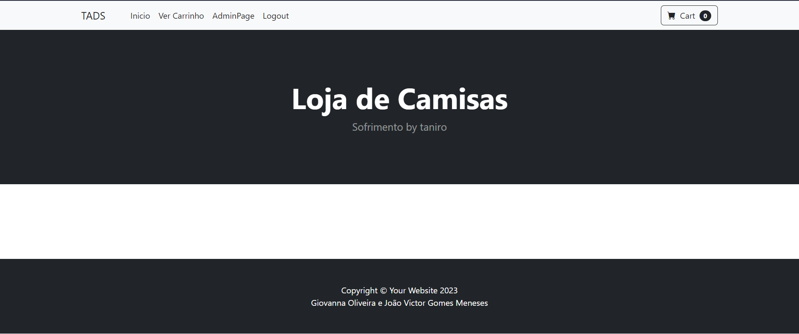
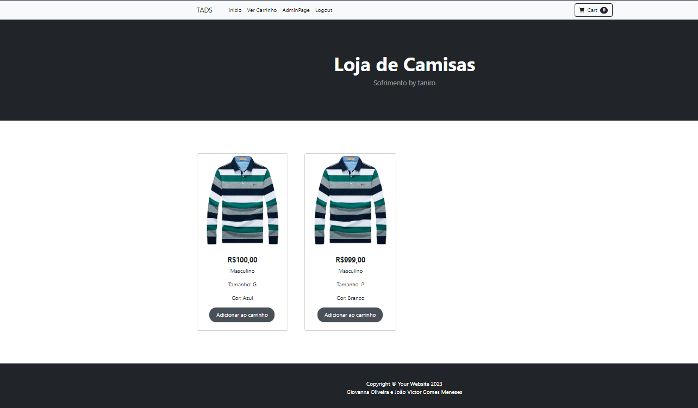
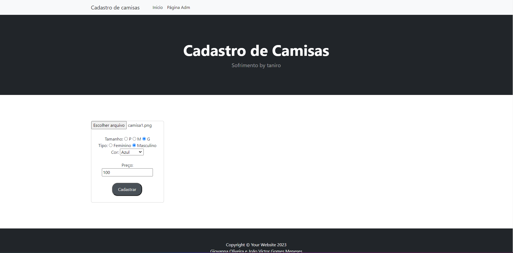
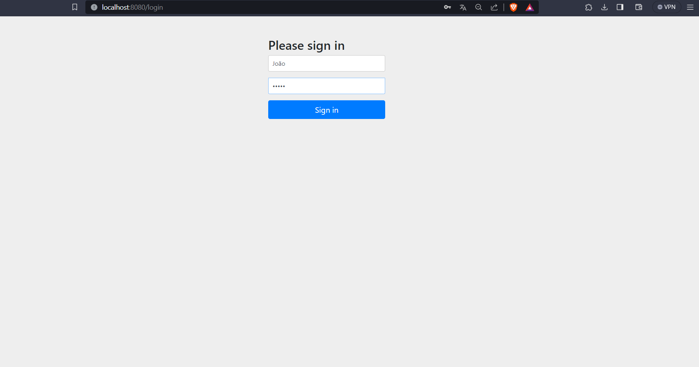

# Projeto: Loja de Camisas - SpringBoot
## Descrição do Projeto
Este projeto é uma aplicação de uma loja de camisas desenvolvida utilizando o framework SpringBoot. A aplicação incorpora diversos aspectos, desde configurações iniciais do projeto até funcionalidades avançadas como autenticação de usuários, soft-delete, carrinho de compras, e integração com frontend usando Thymeleaf e Bootstrap. A seguir, estão descritos os principais pontos do projeto.

## Configuração do Projeto
### Spring Initializr:
O projeto foi criado utilizando o Spring Initializr com as seguintes dependências:

Spring Boot Dev Tools
Lombok
Spring Web
Thymeleaf
Spring Data JPA
PostgreSQL Driver
Spring Validator

## Classe do Modelo:
Uma classe de modelo foi implementada com pelo menos 7 atributos, incluindo ID, Deleted e ImageUri.
Restrições (validações) foram adicionadas ao modelo.

## Autenticação de Usuário
Classe do Usuário:
Foi implementada uma classe de usuário que implementa a interface UserDetails.
Os usuários podem assumir os papéis "ROLE_ADMIN" e "ROLE_USER".
Spring Security:

O Spring Security foi integrado ao projeto para autenticação e controle de acesso.
BCrypt é utilizado para codificar as senhas.
Templates Thymeleaf com Bootstrap
Thymeleaf com Bootstrap:
Os templates Thymeleaf foram preparados para utilizar Bootstrap.
Foram utilizados fragments para separar cabeçalho, principal e rodapé.
Um template HTML do startbootstrap.com foi utilizado como base.
Rotas da Aplicação
Rota "/index":
Exibe uma tabela de itens presentes no banco de dados (soft-delete).
Adiciona links para "/adicionarCarrinho" e "/verCarrinho".
Inclui um cookie "visita" permanente com a data e hora do acesso.
Rota "/admin":
Exibe uma tabela de itens no banco de dados para administração.
Adiciona links para "/editar" e "/deletar".
Inclui um link para a rota "/cadastro".
Rota "/cadastro":
Exibe um formulário para cadastrar um novo item, incluindo upload de imagem.
Utiliza Thymeleaf para tratamento de erros.
Os dados do formulário são enviados via POST para "/salvar".
Rota "/editar":
Exibe um formulário preenchido com os dados do item escolhido para edição.
Os dados são enviados via POST para "/salvar".
Após a atualização, redireciona para "/admin" com mensagem de sucesso.
Rota "/salvar":
Recebe dados via POST para cadastrar ou atualizar um item no banco.
Valida os atributos do modelo e gera um nome único para a imagem.
Redireciona para "/admin" com mensagem de sucesso.
Rota "/deletar":
Recebe dados via GET para realizar um soft-delete de um item no banco.
Redireciona para "/index" com mensagem de sucesso.
Rota "/adicionarCarrinho":
Ao receber uma solicitação GET com o ID do item, adiciona o item ao carrinho na Sessão HTTP.
Atualiza a página "/index" para exibir a quantidade de itens no carrinho.
Rota "/verCarrinho":
Exibe todos os itens do carrinho na Sessão HTTP.
Redireciona para "/index" se o carrinho estiver vazio, com um link para "/finalizarCompra".
Rota "/finalizarCompra":
Ao receber uma solicitação GET, invalide a Sessão e redirecione para "/index".
## Segurança e Controle de Acesso

### Spring Security:
Implementa controle de acesso utilizando Spring Security.
Restringe o acesso a determinadas páginas com base nos papéis dos usuários.
Exibe o username no cabeçalho da página.
Inclui um botão de logout.
## Usuários Padrão:
Configura a aplicação para cadastrar automaticamente 3 usuários ao ser executada.
Um usuário admin e dois usuários padrão.

#Telas do projeto:

## Home:

## AdminPage:

##  Home com cadastradas:

##  Cadastro:

## Login:

